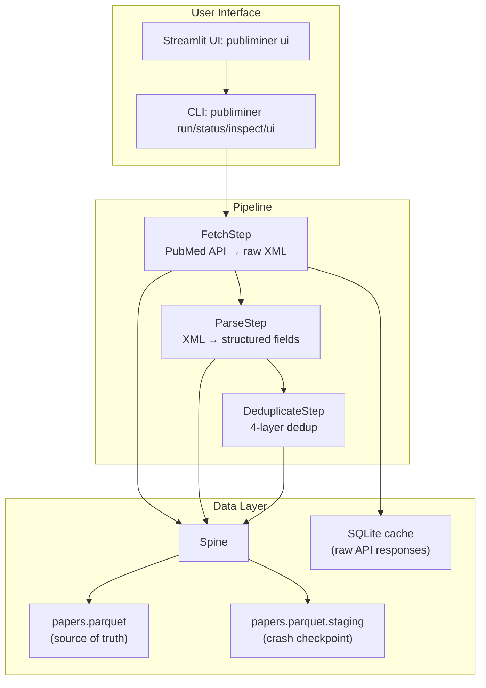

# PubLiMiner

> Publication Literature Miner — fetch, parse, deduplicate, embed, cluster, and extract structured data from PubMed at scale.

[](https://pypi.org/project/publiminer/)
[](https://pypi.org/project/publiminer/)
[](https://github.com/sdamirsa/PubLiMiner/actions/workflows/ci.yml)
[](https://github.com/sdamirsa/PubLiMiner/blob/main/LICENSE)

PubLiMiner is a modular Python pipeline for mining biomedical literature from PubMed. It is designed for **200K+ paper corpora** with monthly incremental updates, a single Parquet file as the source of truth, and pluggable steps for embedding, clustering, and LLM-based structured extraction.

## Features

- **PubMed retrieval** — date-batched fetcher with rate limiting, retry, and SQLite response caching
- **XML parsing** — extracts title, abstract, authors, journal, year, DOI, MeSH, keywords, grants, publication type, and more
- **Deduplication** — 4-layer: PMID exact → DOI exact → fuzzy title (year-grouped) → retracted-paper removal
- **Single source of truth** — every step reads/writes columns to one `papers.parquet` file
- **Streamlit UI** — visual config editor, live progress, status panel, and an Explore tab with lazy-scan filters (year slider, publication-status, language) and sampling modes (first-N / random-N / stride), plus XLSX/JSON download
- **Resumable** — atomic writes, idempotent imports, crash-safe
- **Legacy import** — bulk-import existing JSON batches without re-downloading
- **CLI + library** — use as a Typer CLI or as a Python package

## Pipeline overview

```
fetch → parse → deduplicate → embed → reduce (optional)
                                ├→ cluster → sample → extract → score → trend
                                ├→ rag
                                └→ export ← trend, patent
```

Currently implemented: **fetch**, **parse**, **deduplicate**. The remaining steps are scaffolded in the architecture and being added incrementally.

## Architecture

> Full architecture diagrams: [`docs/architecture.md`](https://github.com/sdamirsa/PubLiMiner/blob/main/docs/architecture.md)



**Key design decisions:**
- **Single Parquet file** is the source of truth — every step reads columns, adds columns, writes back
- **Staging checkpoint** makes fetch crash-safe — resume from where you left off
- **Incremental parse** — only processes rows where `title IS NULL`
- **Memory-bounded** — fetch streams in 5 MB batches, merge uses pyarrow row groups (~50 MB cap)
- **Binary bisection + PMID-list fallback** — handles PubMed's 10k pagination limit automatically

## Getting started

Requires **Python 3.11+**. Pick the path that matches how you want to use it.

<details>
<summary><b>🖱️ No-code users — click through a UI (recommended for first time)</b></summary>

```bash
pip install "publiminer[ui]"
publiminer ui
```

The browser opens to a 4-tab interface:

1. **Config** — set your PubMed query, date range, and output directory, then click **Save YAML**
2. **Run** — click **Run pipeline**; watch the live progress bar
3. **Explore** — filter by year / language / publication status, sample papers (first-N, random, or every Xth), download as XLSX or JSON
4. **Status** — total papers in corpus, file size, schema

Optional: put your NCBI API key in a `.env` file (raises rate limit 3 → 10 req/sec):
```bash
echo NCBI_API_KEY=your_key > .env
```

</details>

<details>
<summary><b>⌨️ Developers — CLI + Python API</b></summary>

```bash
pip install publiminer                    # core only
pip install "publiminer[all]"             # + UI + viz + rag + dev tools
```

Run via CLI:
```bash
publiminer run --config publiminer.yaml               # full pipeline
publiminer run --steps parse,deduplicate              # specific steps
publiminer status --output output                     # corpus summary
publiminer inspect parse --output output              # step metadata
publiminer import-legacy /path/to/batches --output output   # idempotent import
```

Use as a library:
```python
from publiminer import FetchStep, ParseStep, DeduplicateStep, Spine, GlobalConfig

cfg = GlobalConfig()                      # loads publiminer.yaml + defaults
spine = Spine("output")
print(spine.count(), "papers currently in spine")
```

From source (for contributors):
```bash
git clone https://github.com/sdamirsa/PubLiMiner.git
cd PubLiMiner
uv sync --all-extras
uv run pytest                             # run tests
uv run publiminer ui                      # launch UI from the checkout
```

</details>

## Project layout

```
src/publiminer/
├── core/         # Spine (Parquet), cache (SQLite), config, models, base step
├── steps/        # Pipeline steps — each self-contained (step.py, schema.py, default.yaml)
│   ├── fetch/
│   ├── parse/
│   └── deduplicate/
├── utils/        # Logger, rate limiter, env loader, batching, progress, legacy import
├── ui/           # Streamlit UI
├── cli.py        # Typer CLI
└── pipeline.py   # Full run orchestrator
```

## Configuration

PubLiMiner uses a single `publiminer.yaml` file. Each step has its own section with sane defaults — you only need to override what you want to change.

```yaml
general:
  output_dir: output
  log_level: INFO
fetch:
  query: "diabetes AND machine learning"
  start_date: "2024/01/01"
  end_date: "2024/12/31"
  email: ""           # or set PUBMED_EMAIL env var
  api_key: ""         # or set NCBI_API_KEY env var
  max_results: 0      # 0 = no cap (use date partitioning for large queries)
parse:
  prepare_llm_input: true
  flag_exclusions: true
deduplicate:
  fuzzy_threshold: 90
  remove_retracted: true
```

**Secrets** (`NCBI_API_KEY`, `OPENROUTER_API_KEY`, `PATENT_API_KEY`) should always come from environment variables, never the YAML.

## Resumable nightly runs

PubLiMiner is designed to be re-run nightly without redoing any work:

- **Streaming fetch**: every batch is flushed to a `papers.parquet.staging` checkpoint, so a crash mid-run loses nothing. The next run merges the staging file before continuing. Memory stays bounded (~50 MB) regardless of corpus size.
- **Incremental parse**: only rows without a `title` column are parsed. After the first sweep, subsequent runs only touch newly-fetched papers.
- **Auto date resume**: set `fetch.start_date: "auto"` to resume from (latest `fetch_date` − 7 days). The 7-day overlap covers PubMed back-dating and is harmless because PMID-level dedup skips anything already on disk.
- **`run_nightly.bat`**: Windows wrapper that logs to `nightly.log`. Schedule via Task Scheduler:
  ```
  schtasks /create /tn "PubLiMiner Nightly" /tr "C:\path\to\PubLiMiner\run_nightly.bat" /sc daily /st 02:00
  ```

## Performance notes

- **400K papers**: ~1.0–1.2 GB parquet, ~30–60 min total runtime with an NCBI API key
- **PubMed WebEnv limit**: a single esearch+efetch session caps at 9,999 records — use date partitioning (`start_date` / `end_date`) for larger queries
- **Memory**: parse streams in 5K-row batches (~1.5 GB peak on a 500K-row corpus); dedup reads only the columns it needs per layer (~1 GB peak). The only step that loads the full parquet is the final `add_columns` write after parse, which spikes to ~3–5 GB transiently depending on corpus size
- **Parquet format**: files are written with zstd-3 compression and 50K-row groups — required for `pyarrow.iter_batches` to actually stream. If you have a pre-v0.1.x parquet written with snappy and large row groups, run `uv run python scripts/migrate_parquet.py` once to re-chunk it
- **Disk**: keep at least 2× your final parquet size free for atomic writes

## Development

See [CLAUDE.md](https://github.com/sdamirsa/PubLiMiner/blob/main/CLAUDE.md) for the developer guide (architecture, conventions, how to add a new step).

```bash
pip install -e ".[dev]"
pytest                          # run the test suite
ruff check src/                 # lint
ruff format src/                # format
mypy src/publiminer/            # type-check
```

## License

MIT — see [LICENSE](https://github.com/sdamirsa/PubLiMiner/blob/main/LICENSE).

## Citation

If you use PubLiMiner in academic work, please cite the repository:

```bibtex
@software{publiminer,
  author = {Safavi-Naini, Seyed Amir Ahmad},
  title = {PubLiMiner: Publication Literature Miner},
  url = {https://github.com/sdamirsa/PubLiMiner},
  year = {2026}
}
```
