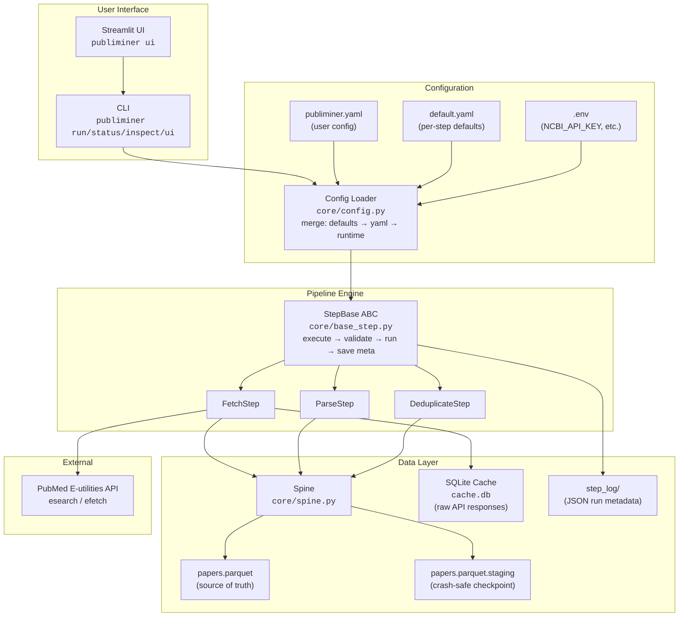
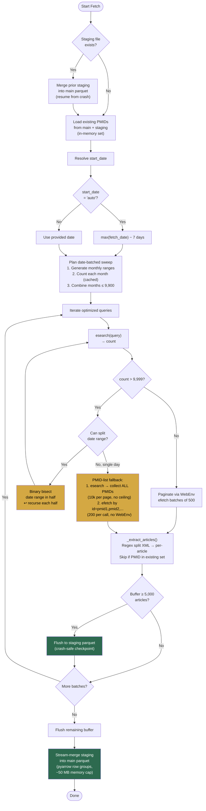
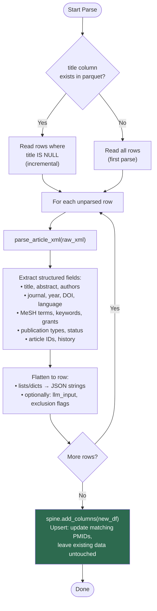
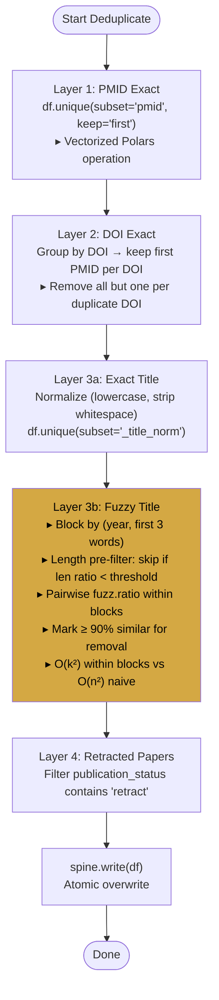
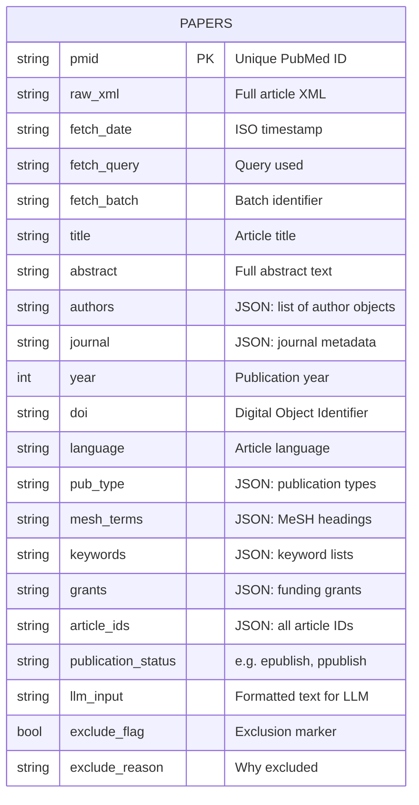
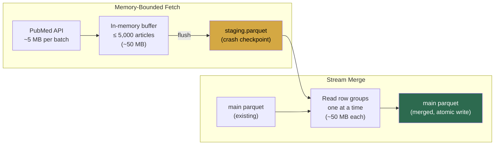
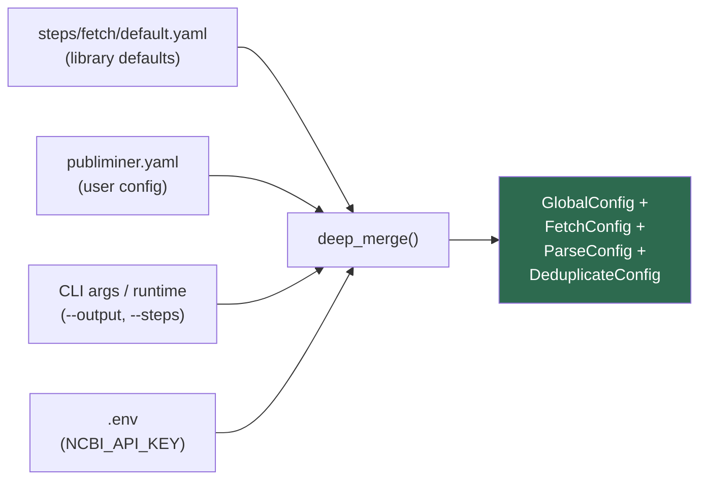

# PubLiMiner Architecture

## System Overview



## Pipeline Flow


## Fetch Step — Detailed Logic



## Parse Step — Detailed Logic



## Deduplicate Step — Four Layers



## Data Model — Parquet Schema



## Memory & Crash Safety Model



## Config Merge Chain



## Retry & Rate Limiting

```mermaid
flowchart TD
    REQ["HTTP Request"] --> RATE["Token bucket<br/>rate limiter<br/>(3 or 10 req/sec)"]
    RATE --> TRY["Send request"]
    TRY --> STATUS{Response?}

    STATUS -->|200 OK| DONE["Return data"]
    STATUS -->|429 / 5xx| RETRY["Exponential backoff<br/>2^attempt + jitter<br/>(max 60s)"]
    STATUS -->|Network error<br/>peer closed /<br/>timeout / DNS| RETRY
    STATUS -->|4xx client error<br/>(not 429)| FAIL["Raise APIError<br/>(no retry)"]

    RETRY --> ATTEMPT{Attempt<br/>< max_retries?}
    ATTEMPT -->|Yes| TRY
    ATTEMPT -->|No| FAIL

    style FAIL fill:#c0392b,color:#fff
    style DONE fill:#2d6a4f,color:#fff
```
